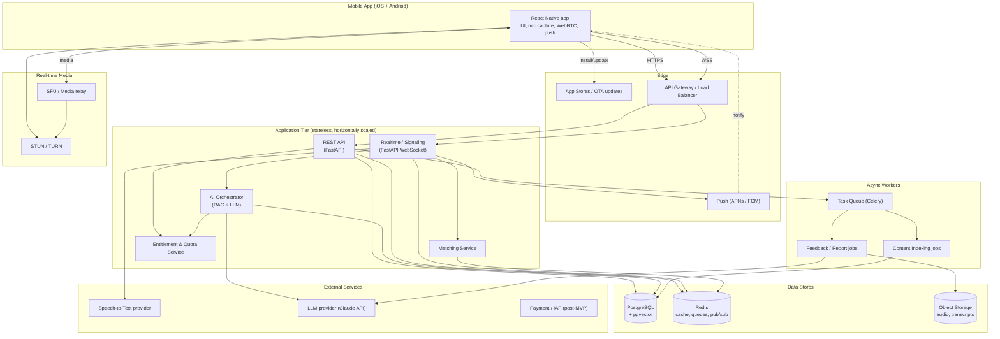
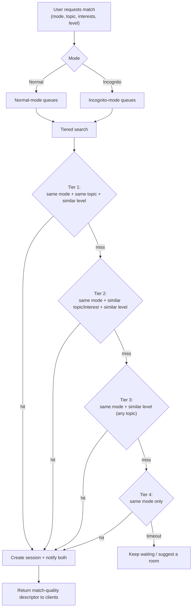
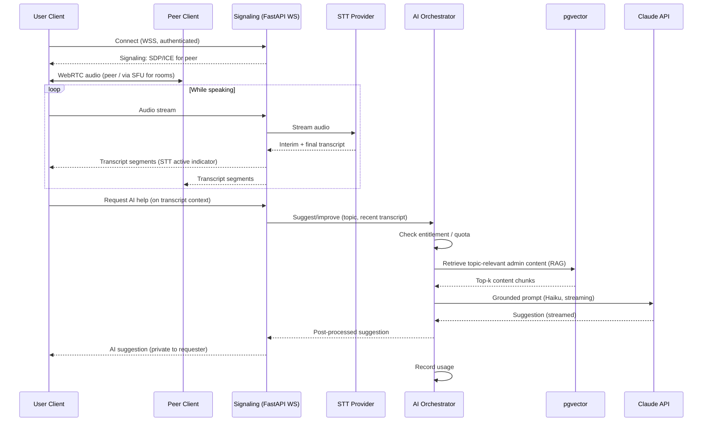
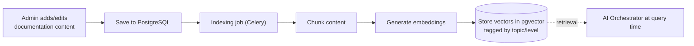
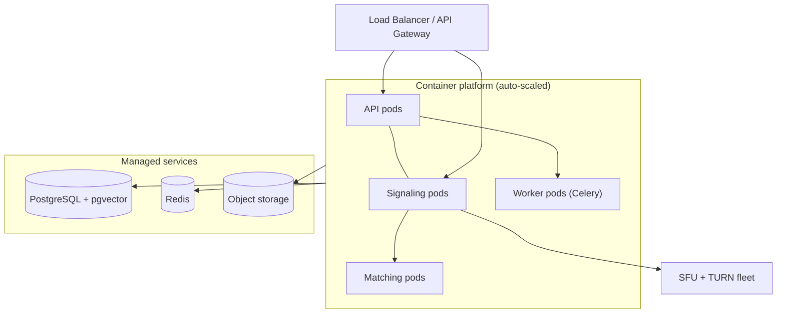

# 06 Architecture

## 1. Purpose and Scope

This document describes the system architecture for **EnglishTalker**, the English speaking practice
platform defined in [01_PRD.md](./01_PRD.md). It explains the high-level structure, major components,
technology choices, data flows, and the key design decisions and trade-offs behind them.

The product is delivered as a **cross-platform mobile app (iOS + Android)**, not a website. The
architecture targets the **MVP scope** in PRD §11 first, while keeping clear extension points for the
*should-have* and *future* features (conversation history, AI-only partner, video, web client).

> **Note — reconcile with PRD §11.3:** the PRD currently lists "Mobile app" as *out of scope for MVP*.
> That line predates the decision to ship a mobile app first; the PRD should be updated so the two
> documents agree. A **web client** is the item that is now out of MVP scope instead.

Out of scope for this document: detailed table definitions (see [07_Database.md](./07_Database.md)),
endpoint contracts (see [08_API.md](./08_API.md)), AI prompt/RAG internals (see
[10_AI_Design.md](./10_AI_Design.md)), security controls (see [11_Security.md](./11_Security.md)), and
deployment procedures (see [13_Deployment.md](./13_Deployment.md)).

---

## 2. Architecture Goals and Principles

The architecture is driven by the product needs in the PRD and the quality targets in
[04_NFR.md](./04_NFR.md).

| Goal                             | Driver (PRD / NFR)                            | Architectural response                                                                 |
| -------------------------------- | --------------------------------------------- | -------------------------------------------------------------------------------------- |
| Low-latency conversation         | Speaking practice must feel live (§8.3–8.5)   | WebRTC peer media + WebSocket signaling; co-located media relays                       |
| Near real-time AI help           | AI assists *during* conversation (§8.8)       | Streaming LLM calls, fast model for in-call suggestions, async for reports             |
| Fair, fast matching              | Match by mode/topic/interest/level (§8.4–8.6) | Redis-backed matching queue with relaxation tiers                                      |
| Strong privacy in Incognito      | Identity isolation (§7.2)                     | Mode-partitioned matching + identity stripping at the edge                             |
| Topic-grounded AI                | RAG over admin content (§8.2, §8.8)           | Vector store + retrieval pipeline feeding the LLM                                      |
| Clear plan limits                | Free vs Premium gating (§8.10)                | Centralized entitlement/quota service checked on every metered action                  |
| Scale to many concurrent talkers | 10,000 concurrent users (NFR)                 | Stateless API tier, externalized state (Redis/Postgres), horizontally scalable workers |

**Guiding principles**

1. **Stateless application tier** — all session and conversation state lives in Redis/PostgreSQL so API
  and signaling nodes can scale horizontally and fail over freely.
2. **Separation of real-time and request/response** — synchronous REST for CRUD; WebSockets for live
  conversation and signaling; background workers for slow AI work.
3. **Privacy by construction** — Incognito identity is never sent to the client of a peer; mode is a hard
  partition, not a filter.
4. **Provider-pluggable AI and STT** — speech and LLM providers sit behind internal interfaces so they can
  be swapped without touching product code.
5. **Graceful degradation** — if STT or AI is slow or down, the conversation continues (PRD §14.4, §14.7).

---

## 3. High-Level Architecture

The system has five logical layers:

1. **Client** — a React Native mobile app (iOS + Android) that captures microphone audio, runs WebRTC
  media, renders transcripts, surfaces AI suggestions, and receives push notifications (e.g. "match
  found").
2. **Edge** — app distribution via the stores/OTA updates, a load balancer / API gateway terminating TLS
  and routing HTTP and WebSocket traffic, and push delivery via APNs/FCM.
3. **Application tier** — stateless services: REST API, realtime/signaling, matching, entitlements, and the
  AI orchestrator.
4. **Async workers** — background jobs for slow or batchable work (post-conversation feedback, admin
  content indexing).
5. **Data and external services** — PostgreSQL (+pgvector), Redis, object storage, and third-party STT,
  LLM, and (later) payment providers.

---

## 4. Technology Stack

The stack keeps the data-layer direction suggested in [help.md](./help.md) (PostgreSQL, Redis, AI service)
but **uses FastAPI instead of Django** for the application tier. FastAPI is async-native, which suits the
real-time, high-concurrency workload of this app (WebSocket signaling, audio streaming to STT, and
streaming LLM responses), and Python keeps the AI/RAG ecosystem close at hand. The trade-off — losing
Django's built-in admin — is covered by a lightweight admin layer (see the Admin row below).

| Layer                   | Choice                                                                        | Rationale                                                                                                   |
| ----------------------- | ----------------------------------------------------------------------------- | ----------------------------------------------------------------------------------------------------------- |
| Mobile client           | **React Native + TypeScript** (iOS + Android)                                 | One codebase for both platforms; team uses JS/TS; mature native modules for the features below; clear path to a shared web client later |
| Mobile WebRTC           | **react-native-webrtc**                                                        | Native WebRTC bindings for RN — peer audio, ICE, and SFU connectivity                                       |
| Audio / mic             | RN audio session APIs (foreground/background, interruptions)                  | Reliable mic capture and playback during calls, including backgrounding and phone-call interruptions        |
| Push notifications      | **APNs / FCM** (e.g. via Firebase / Expo)                                     | "Match found", room invites, re-engagement — important when matching is async (PRD §14.1)                    |
| Styling/UI              | RN component library (see [09_UI_UX.md](./09_UI_UX.md))                       | Consistent UI across iOS/Android (NFR usability)                                                            |
| API                     | **FastAPI** (Python, ASGI) + **Pydantic v2**                                  | Async-native, high-throughput; typed request/response models; auto OpenAPI for [08_API.md](./08_API.md)     |
| Realtime/signaling      | **FastAPI / Starlette WebSocket** + **Redis pub/sub**                         | Native async WebSocket; Redis pub/sub fans messages out across stateless nodes                              |
| ORM / migrations        | **SQLAlchemy 2.0 (async)** + **Alembic**                                      | Mature async ORM and versioned migrations to pair with FastAPI                                              |
| Auth                    | **JWT** via `fastapi-users` / `python-jose` + `passlib`                       | Token auth on REST + WS (NFR); user management without Django's auth app                                    |
| Admin panel             | **SQLAdmin** (SQLAlchemy admin) or React-Admin                               | Replaces Django Admin for managing topics & documentation content (PRD §8.1, §8.2, §9.2)                    |
| Async tasks             | **Celery** + Redis broker (or **ARQ** for async-native)                       | Offloads feedback generation and content indexing from request path                                         |
| Matching                | Custom service on **Redis** sorted sets                                       | Low-latency, in-memory queues with tiered relaxation                                                        |
| Database                | **PostgreSQL**                                                                | Relational core (users, rooms, notes, subscriptions); proven and operationally simple                       |
| Vector search           | **pgvector** extension                                                        | RAG embeddings co-located with Postgres — avoids a separate vector DB at MVP scale                          |
| Cache / queue / pub-sub | **Redis**                                                                     | Sessions, rate limits, matching queues, WebSocket pub/sub, task broker                                      |
| Object storage          | **S3-compatible**                                                             | Stored audio (if enabled) and exported transcripts                                                          |
| Media transport         | **WebRTC** (peer audio), **self-hosted SFU** for rooms, **STUN/TURN**         | Direct low-latency audio; self-hosted SFU (e.g. mediasoup/Janus) for multi-party rooms; TURN for NAT traversal |
| Speech-to-Text          | Pluggable **cloud streaming STT** provider; **on-device OS recognizer** (Apple Speech / Android SpeechRecognizer) as fallback | Real-time transcripts (PRD §8.9); provider behind an interface. (Browser Web Speech API does **not** apply to a native app.) |
| LLM                     | **Claude API**                                                                | In-call suggestions and post-call feedback; grounded via RAG                                                |

### 4.1 LLM model selection

The AI orchestrator routes to different Claude models by task, balancing latency against depth (see
[10_AI_Design.md](./10_AI_Design.md) for prompts):

| Use case                                                    | Model                                    | Why                                                  |
| ----------------------------------------------------------- | ---------------------------------------- | ---------------------------------------------------- |
| In-conversation suggestions / quick corrections (real time) | **Claude Haiku 4.5** (`claude-haiku-4-5`) | Lowest latency for "near real-time" help (PRD §8.8)  |
| Post-conversation feedback report (async)                   | **Claude Sonnet 5** (`claude-sonnet-5`)   | Free tier — good quality where latency is not critical |
| IELTS band report / deep analysis                           | **Claude Opus 5** (`claude-opus-5`)       | Judgement task; cost-gated to Premium                |

> Model IDs carry **no date suffix**. It is `claude-haiku-4-5`, never
> `claude-haiku-4-5-20251001`.

The table above is the *intent*. The **authoritative, per-tier routing table lives
in [18_AI_Provider_Architecture.md](./18_AI_Provider_Architecture.md) §18.5**, and is
loaded from the `AI_ROUTES` environment variable — so models can be swapped per task
and per plan tier without a code change or a deploy. Do not add a second copy of the
model list here; keep this section as the summary and that one as the source of truth.

Prompts and per-task reasoning effort: [10_AI_Design.md](./10_AI_Design.md).

---

## 5. Component Responsibilities

### 5.1 Mobile Client (React Native, iOS + Android)

- Captures microphone audio (`react-native-webrtc`) and manages WebRTC peer connections, including
  audio-session handling for backgrounding and phone-call interruptions.
- Sends/receives signaling over WebSocket; renders the live transcript and AI suggestions.
- Runs the STT path appropriate to the build: streams audio for cloud STT, or uses the on-device OS
  recognizer as the offline/low-cost fallback.
- Handles push notifications (APNs/FCM) for async events such as "match found".
- Enforces UX rules: shows when STT is active (PRD §8.9 rules), shows match-quality messages
  ("we found a similar level…", PRD §8.5), and surfaces plan limits before they are hit (PRD §8.10).
- Never receives a peer's real identity in Incognito mode.

### 5.2 REST API (FastAPI)

- Authentication, profile (level, interests, mode), topics, sentence notes, room/match lifecycle CRUD,
subscription/plan display, and the admin content surface.
- Pydantic models define request/response contracts and auto-generate the OpenAPI spec behind
[08_API.md](./08_API.md); data access via async SQLAlchemy.
- Delegates every metered action (AI calls, notes, match sessions) to the **Entitlement & Quota Service**.
- Exposes an **admin panel** (SQLAdmin / React-Admin) for admins to manage topics and documentation
content (PRD §8.1, §8.2, §9.2).

### 5.3 Realtime / Signaling Service (FastAPI WebSocket)

- Manages WebSocket connections, room membership, presence, and WebRTC signaling (SDP/ICE exchange) using
FastAPI/Starlette's native async WebSocket support.
- Streams audio to the **STT provider** and broadcasts interim/final transcript segments to participants.
- Invokes the **AI Orchestrator** for in-call suggestions and relays results to the requesting user.
- Uses **Redis pub/sub** to fan messages out across nodes, so any stateless node can serve any connection.

### 5.4 Matching Service

- Maintains per-mode, per-criteria waiting queues in Redis for **Match One** and **Random Match**.
- Applies the matching policy (see §7) and, on a match, creates a room/session and notifies both clients.
- Returns a *match-quality descriptor* so the client can explain inexact matches (PRD §8.5).

### 5.5 AI Orchestrator (RAG + LLM)

- Retrieves topic-relevant admin content from pgvector, builds a grounded prompt, calls the LLM, and
post-processes the output (safety, brevity, tone per PRD §8.8 rules).
- Handles two paths: **streaming async** for in-call help, **background worker** (Celery/ARQ) for
feedback reports.
- Checks entitlements before calling the LLM and records usage afterward.

### 5.6 Entitlement & Quota Service

- Single source of truth for Free vs Premium capabilities and daily/period limits (PRD §8.10).
- Maintains counters in Redis (fast, atomic) with periodic reconciliation to PostgreSQL.
- Returns structured "limit reached" responses so the UI can explain limits in simple words (PRD §14.6),
and never interrupts an in-progress conversation purely for payment reasons (PRD §8.10 rules).

### 5.7 Async Workers (Celery / ARQ)

- **Feedback/report jobs** — generate post-conversation AI feedback (should-have, PRD §11.2).
- **Content indexing jobs** — chunk and embed admin documentation into pgvector when content changes.

---

## 6. Data Architecture

Detailed schema lives in [07_Database.md](./07_Database.md); this section covers the *placement* of data.

| Store              | Holds                                                                                                        | Notes                                          |
| ------------------ | ------------------------------------------------------------------------------------------------------------ | ---------------------------------------------- |
| **PostgreSQL**     | Users, profiles, topics, documentation content, rooms, sessions, sentence notes, subscriptions, usage ledger | System of record                               |
| **pgvector**       | Embeddings of admin documentation chunks                                                                     | Co-located with Postgres for RAG retrieval     |
| **Redis**          | Sessions/presence, matching queues, quota counters, rate limits, WebSocket pub/sub, task broker             | Volatile/operational state; rebuildable        |
| **Object storage** | Optional stored audio, exported transcripts                                                                  | Lifecycle/retention policy applies (see §10.2) |

**State ownership rule:** application nodes hold no durable state. Conversation state (membership,
transcript buffer) lives in Redis during the call and is persisted to PostgreSQL/object storage according
to retention policy.

---

## 7. Matching Architecture

Matching enforces PRD §8.6 conditions with a **hard partition on mode** and **soft preference** on the
rest.

- **Mode is required and absolute**: Normal users only ever enter Normal queues; Incognito users only
Incognito queues (PRD §7, §12). The two never intersect.
- **Relaxation tiers** progressively loosen topic → interest → level, mirroring PRD §14.5. The tier that
produced the match is reported so the client can show the right message.
- **Level guard**: a wide level gap (e.g., new beginner ↔ advanced) is excluded unless both users opted in
(PRD §8.6 Level).
- **Random Match** uses the same engine but starts at a relaxed tier and also considers placing the user in
an existing open room (PRD §8.5).

---

## 8. Conversation, STT, and AI Data Flow

End-to-end flow for an active conversation with Speech-to-Text and in-call AI help.

Key behaviors:

- **STT visibility & resilience**: clients always show when STT is on; if STT errors, the conversation
continues and AI can still operate on whatever text exists (PRD §8.9, §14.7).
- **AI privacy**: in-call suggestions are returned only to the requesting user, not broadcast to the room
(an open question in PRD §17, defaulted here to private; configurable).
- **Grounding**: every AI suggestion is built from retrieved admin content for the selected topic
(PRD §8.2, §8.8) — see [10_AI_Design.md](./10_AI_Design.md).

---

## 9. RAG / Content Indexing Flow

Admin content is the trusted knowledge base. Indexing runs asynchronously on content change so retrieval
always reflects the latest approved material. Chunks are tagged by topic and level so retrieval stays
scoped to the conversation's topic (PRD §8.8 "stay related to the topic").

---

## 10. Cross-Cutting Concerns

### 10.1 Security & Authorization

- Token-based auth (JWT per NFR) on REST and WebSocket connections; see [11_Security.md](./11_Security.md).
- Role separation: **Normal User** vs **Admin** (PRD §9). Admin-only content/topic management is enforced
server-side, not just hidden in the UI.
- Rate limiting and quota checks at the edge and in the Entitlement service.
- TLS everywhere (HTTPS/WSS); DTLS-SRTP for WebRTC media.

### 10.2 Privacy (Incognito) & Data Retention

- **Incognito isolation**: real identity is stripped at the signaling/API edge; peers receive only a
temporary display name. Mode partitioning in matching guarantees Incognito users never meet Normal users.
- **Transcripts/audio**: retention is policy-driven (PRD §17 open questions). Default posture: transcripts
available during/after a session for review, with user delete and (post-MVP) export; Incognito sessions
get the shortest retention. Finalized in [11_Security.md](./11_Security.md).

### 10.3 Scalability & Performance

- Stateless API/signaling nodes scale horizontally behind the load balancer; all shared state in
Redis/PostgreSQL (NFR: 10,000 concurrent users).
- REST p95 target < 500 ms (NFR) achieved by keeping LLM/STT off the synchronous request path — AI runs
over WebSocket streaming or async workers.
- Media scales via SFU for rooms (server relays instead of N×N peer mesh) and TURN for restrictive
networks.
- Redis-backed matching keeps queue operations in-memory for fast pairing.

### 10.4 Reliability & Graceful Degradation

- External provider failures degrade gracefully: no STT → manual continue; no AI → suggestions disabled
with a notice; the live conversation itself never depends on AI/STT availability.
- Async work (feedback, indexing) is retried via Celery; failures don't affect live sessions.

### 10.5 Observability

- Centralized structured logging, metrics, and tracing across API, signaling, workers, and AI calls.
- Product/success metrics from PRD §13 (conversations started/completed, STT usage, AI suggestions used,
notes saved, returning users, upgrades) are emitted as events. Details in
[14_Monitoring.md](./14_Monitoring.md).

---

## 11. Deployment View (Summary)

Containerized services on an auto-scaling platform with managed PostgreSQL, Redis, and object storage. The
SFU/TURN fleet is deployed close to users to minimize media latency. Full procedures, environment
variables, and CI/CD live in [13_Deployment.md](./13_Deployment.md).

---

## 12. Key Design Decisions (ADR Summary)

| #   | Decision                                        | Alternatives considered       | Rationale                                                                                                     |
| --- | ----------------------------------------------- | ----------------------------- | ------------------------------------------------------------------------------------------------------------- |
| 1   | FastAPI (async Python) for backend              | Django+DRF+Channels, NestJS, Go | Async-native for WebSocket/audio/LLM streaming; Python keeps AI/RAG ecosystem close. Trade-off: no built-in admin → add SQLAdmin/React-Admin |
| 2   | WebRTC for audio, self-hosted SFU for rooms     | Server-mixed audio, full mesh, managed SFU (LiveKit) | Lowest latency; SFU avoids mesh blow-up in multi-party rooms; self-hosted keeps full control (accept the added ops cost) |
| 2a  | React Native (TS) cross-platform client         | Flutter, native Swift/Kotlin  | One codebase for iOS + Android; reuses team JS/TS skill; shared web client path later                         |
| 3   | pgvector instead of a dedicated vector DB       | Pinecone, Weaviate, Milvus    | Sufficient at MVP scale; one fewer system to operate; co-located with source content                          |
| 4   | Redis for matching + quotas + pub/sub + broker  | DB-backed queues, Kafka       | In-memory speed for matching/limits; one proven dependency covers several needs                               |
| 5   | Mode as a hard partition in matching            | Mode as a filter              | Guarantees the §7/§12 privacy rule cannot be violated by a relaxation tier                                    |
| 6   | Task-routed Claude models (Haiku/Sonnet/Opus)   | Single model for all AI       | Latency for in-call help vs quality for reports; cost control on Premium                                      |
| 7   | Centralized Entitlement service                 | Inline checks per endpoint    | One consistent place for limits; supports "explain the limit" UX and no mid-call cut-off                      |
| 8   | Provider interfaces for STT and LLM             | Direct SDK calls              | Swap/upgrade providers without product code changes. **Specified in [18_AI_Provider_Architecture.md](./18_AI_Provider_Architecture.md)** — three ports (`LLMProvider`, `Transcriber`, `Translator`), adapters per vendor, config-driven routing. Implemented 2026-08-29 in `backend/app/ai/`; see §18.11 for status and the measured findings |
| 9   | Per-call cost metering (`ai_usage`)             | Provider dashboards only      | Cost per user is the input to pricing and to the free-tier caps; vendor dashboards cannot attribute spend to a user, a tier, or a feature (§18.8) |

---

## 13. Risks and Mitigations (Architecture View)

These extend PRD §14 with architectural responses.

| Risk (PRD ref)                           | Architectural mitigation                                                      |
| ---------------------------------------- | ----------------------------------------------------------------------------- |
| Few users online → slow matching (§14.1) | Tiered relaxation + room fallback; queue keeps user waiting with clear status |
| AI gives bad suggestions (§14.4)         | RAG grounding on admin content + post-processing safety/brevity filter        |
| Matching imperfect (§14.5)               | Tiered engine returns match-quality descriptor for honest UX                  |
| STT wrong (§14.7)                        | Provider-pluggable + conversation independent of STT; user can edit notes     |
| Subscription confusion (§14.6)           | Entitlement service returns structured, explainable limit responses           |
| Concurrency spikes                       | Stateless tiers + externalized state + auto-scaling + SFU/TURN fleet          |

---

## 14. Mapping to PRD Open Questions (§17)

The architecture leaves these configurable and proposes MVP defaults; product to confirm:

| Open question                          | Architectural default / hook                                                             |
| -------------------------------------- | ---------------------------------------------------------------------------------------- |
| Text, voice, or both?                  | Voice-first with live transcript; text chat is a cheap addition over the same WS channel |
| Room capacity                          | SFU supports small groups; cap configurable per room                                     |
| User-created rooms/topics              | MVP: admin-created; model allows enabling user creation later                            |
| AI suggestions private vs room-visible | Default **private to requester**; configurable per room                                  |
| STT on by default                      | Configurable; client always indicates active state                                       |
| Transcript retention/export            | Policy-driven retention; export is a worker job (post-MVP)                               |

---

## 15. References

- [01_PRD.md](./01_PRD.md) — product requirements (source of truth for features)
- [04_NFR.md](./04_NFR.md) — performance, availability, scalability targets
- [07_Database.md](./07_Database.md) — schema, relationships, indexes
- [08_API.md](./08_API.md) — endpoint contracts
- [10_AI_Design.md](./10_AI_Design.md) — prompts, RAG, AI workflow
- [11_Security.md](./11_Security.md) — auth, authorization, privacy controls
- [13_Deployment.md](./13_Deployment.md) — environments, CI/CD, infrastructure
- [14_Monitoring.md](./14_Monitoring.md) — logging, metrics, alerts

