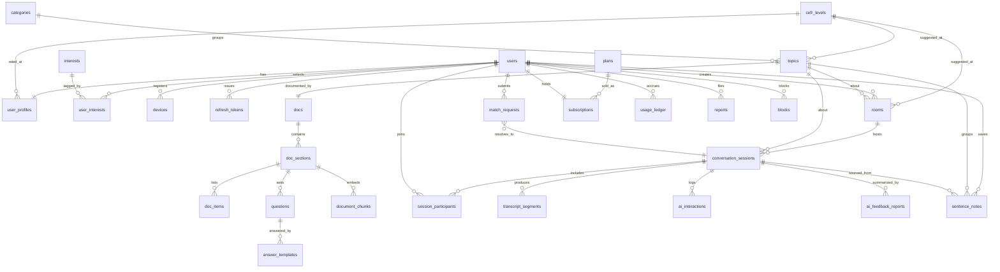

<!-- Purpose: Defines database design, entities, relationships, schemas, indexes, migrations, retention rules, and data integrity requirements. -->

# 07 Database

## 1. Purpose and Scope

This document defines the database design for **EnglishTalker**. It covers the entities, relationships,
schema (DDL), indexes, partitioning, integrity constraints, retention rules, and migration conventions
required to implement the system described in [06_Architecture.md](./06_Architecture.md) and the product
in [01_PRD.md](./01_PRD.md).

The design targets **PostgreSQL** accessed through **SQLAlchemy 2.0 (async)** with **Alembic** migrations,
and uses **pgvector** for Retrieval-Augmented Generation (RAG) over admin documentation (PRD §8.2, §8.8).
Operational/volatile state (matching queues, presence, live transcript buffers, quota counters) lives in
**Redis** and is *not* modeled here except where it is reconciled into PostgreSQL as the system of record.

Endpoint contracts that read/write these tables live in [08_API.md](./08_API.md); retention and privacy
controls are finalized in [11_Security.md](./11_Security.md).

---

## 2. Design Principles

1. **One system of record.** PostgreSQL is authoritative. Redis is a cache/queue and must be rebuildable
   from PostgreSQL (or be safely discardable).
2. **Scalable keys.** Primary keys are `UUID` generated as **UUIDv7** (time-ordered) in the application
   layer. Time-ordering keeps B-tree inserts sequential (no index fragmentation) while avoiding the
   hotspotting and enumeration risks of serial integers across a horizontally scaled, multi-node tier.
3. **Normalize the core, denormalize hot reads deliberately.** Relational integrity for the durable core;
   selective denormalized snapshots (e.g. matching criteria on `match_requests`) only where read latency
   demands it, always documented.
4. **Reference tables for evolving sets, enums for fixed sets.** Admin-evolving sets (interests, topics,
   plans, levels) are tables; small fixed sets (mode, status, role) are PostgreSQL `ENUM`/`CHECK`.
5. **Reusable mixins.** Every table carries `created_at`/`updated_at` (`timestamptz`, UTC). Tables holding
   user-generated or personal data also carry `deleted_at` for soft deletion.
6. **Privacy by construction.** Real identity is never duplicated into Incognito-visible rows; per-session
   display names are stored separately (PRD §7.2). Retention is shortest for Incognito data (§8).
7. **Partition high-volume, time-series tables** (transcripts, AI interactions, usage) by time range so
   old data can be detached/dropped cheaply and queries stay on recent partitions.

### 2.1 Naming Conventions

| Object | Convention | Example |
|--------|-----------|---------|
| Table | `snake_case`, plural | `sentence_notes` |
| Column | `snake_case`, singular | `created_at` |
| Primary key | `id` | `id uuid` |
| Foreign key | `<referenced_singular>_id` | `topic_id` |
| Index | `ix_<table>_<cols>` | `ix_match_requests_waiting` |
| Unique | `uq_<table>_<cols>` | `uq_user_interests` |
| Check | `ck_<table>_<rule>` | `ck_rooms_capacity` |
| Foreign key | `fk_<table>_<col>` | `fk_notes_user_id` |
| Enum type | `<concept>` | `conversation_mode` |

---

## 3. Database Technology and Extensions

| Item | Choice | Notes |
|------|--------|-------|
| Engine | **PostgreSQL 16+** | Declarative partitioning, `gen_random_uuid()`, performance |
| Driver / ORM | **asyncpg** + **SQLAlchemy 2.0 (async)** | Matches FastAPI app tier ([06_Architecture.md](./06_Architecture.md) §4) |
| Migrations | **Alembic** | Versioned, reviewed, reversible (see §11) |
| Vector search | **pgvector** | Embeddings for RAG; HNSW index |
| Crypto / UUID | **pgcrypto** | `gen_random_uuid()` fallback; hashing helpers |
| Fuzzy search | **pg_trgm** | Topic/title search, note search |
| Case-insensitive | **citext** | Email uniqueness without `lower()` gymnastics |

```sql
CREATE EXTENSION IF NOT EXISTS pgcrypto;
CREATE EXTENSION IF NOT EXISTS pg_trgm;
CREATE EXTENSION IF NOT EXISTS citext;
CREATE EXTENSION IF NOT EXISTS vector;
```

> **Embedding dimension:** examples below use `vector(1024)` for Voyage AI `voyage-3` embeddings (the
> recommended pairing with the Claude API). Set the dimension to match the chosen embedding model; changing
> it later requires a re-embed migration (see §11.3).

---

## 4. Shared Building Blocks

### 4.1 Enum Types

```sql
CREATE TYPE user_role           AS ENUM ('user', 'admin');
CREATE TYPE user_status         AS ENUM ('active', 'suspended', 'deleted');
CREATE TYPE conversation_mode   AS ENUM ('normal', 'incognito');
CREATE TYPE session_type        AS ENUM ('room', 'match_one', 'random');
CREATE TYPE session_status      AS ENUM ('pending', 'active', 'ended', 'cancelled');
CREATE TYPE room_status         AS ENUM ('open', 'active', 'closed');
CREATE TYPE match_status        AS ENUM ('waiting', 'matched', 'cancelled', 'expired');
CREATE TYPE content_status      AS ENUM ('draft', 'published', 'archived');
CREATE TYPE doc_section_type    AS ENUM ('vocabulary', 'phrases', 'questions', 'tips', 'text');
CREATE TYPE note_source         AS ENUM ('self', 'ai', 'peer', 'topic_question', 'phrase');
CREATE TYPE ai_request_type     AS ENUM ('suggest_next', 'improve', 'correct', 'natural',
                                         'vocabulary', 'topic_question', 'feedback');
CREATE TYPE subscription_status AS ENUM ('trialing', 'active', 'past_due', 'cancelled', 'expired');
CREATE TYPE report_status       AS ENUM ('open', 'reviewing', 'resolved', 'dismissed');
CREATE TYPE device_platform     AS ENUM ('ios', 'android');
```

> **Why enums here:** these sets are fixed by product rules and rarely change. Adding a value is a one-line
> `ALTER TYPE ... ADD VALUE` migration. Sets that admins manage (interests, topics, plans, CEFR labels) are
> modeled as **tables** instead, so they can change at runtime without migrations.

### 4.2 `updated_at` Trigger (reused by every table)

```sql
CREATE OR REPLACE FUNCTION set_updated_at() RETURNS trigger AS $$
BEGIN
    NEW.updated_at = now();
    RETURN NEW;
END;
$$ LANGUAGE plpgsql;

-- Applied per table, e.g.:
-- CREATE TRIGGER trg_users_updated_at BEFORE UPDATE ON users
--   FOR EACH ROW EXECUTE FUNCTION set_updated_at();
```

All tables include:

```sql
created_at  timestamptz NOT NULL DEFAULT now(),
updated_at  timestamptz NOT NULL DEFAULT now()
```

Tables marked **(soft-delete)** also include `deleted_at timestamptz` and filter `WHERE deleted_at IS NULL`
in the ORM default scope.

---

## 5. Entity-Relationship Overview



---

## 6. Schema by Domain

> **DDL ordering:** the blocks below are grouped by domain for readability, not strict creation order. A few
> forward references exist (e.g. `match_requests.matched_session_id` → `conversation_sessions`). Alembic
> resolves these by creating tables first and adding such FKs in a later step within the same revision, or
> by ordering `conversation_sessions` before `match_requests`.

### 6.1 Identity and Access

```sql
CREATE TABLE users (
    id              uuid PRIMARY KEY,
    email           citext NOT NULL,
    password_hash   text   NOT NULL,
    role            user_role   NOT NULL DEFAULT 'user',
    status          user_status NOT NULL DEFAULT 'active',
    email_verified_at timestamptz,
    last_login_at     timestamptz,
    created_at      timestamptz NOT NULL DEFAULT now(),
    updated_at      timestamptz NOT NULL DEFAULT now(),
    deleted_at      timestamptz,                                   -- (soft-delete)
    CONSTRAINT uq_users_email UNIQUE (email)
);

CREATE TABLE devices (
    id          uuid PRIMARY KEY,
    user_id     uuid NOT NULL REFERENCES users(id) ON DELETE CASCADE,
    platform    device_platform NOT NULL,
    push_token  text NOT NULL,                                     -- APNs/FCM token (06_Architecture push)
    last_seen_at timestamptz,
    created_at  timestamptz NOT NULL DEFAULT now(),
    updated_at  timestamptz NOT NULL DEFAULT now(),
    CONSTRAINT uq_devices_push_token UNIQUE (push_token)
);

CREATE TABLE refresh_tokens (
    id          uuid PRIMARY KEY,
    user_id     uuid NOT NULL REFERENCES users(id) ON DELETE CASCADE,
    token_hash  text NOT NULL,                                     -- store hash, never the raw token
    device_id   uuid REFERENCES devices(id) ON DELETE SET NULL,
    expires_at  timestamptz NOT NULL,
    revoked_at  timestamptz,
    created_at  timestamptz NOT NULL DEFAULT now(),
    updated_at  timestamptz NOT NULL DEFAULT now(),
    CONSTRAINT uq_refresh_tokens_hash UNIQUE (token_hash)
);
```

| Notes |
|-------|
| Passwords stored as Argon2/bcrypt hashes (`password_hash`); raw tokens never stored — only hashes. |
| `users.status='deleted'` + `deleted_at` enables account soft-deletion while preserving FK integrity for shared content (transcripts of past peers). |
| `devices` drives push for async "match found" (PRD §14.1). |

### 6.2 Profile, Interests, and CEFR Levels

```sql
-- Admin-evolving reference data: ordered proficiency scale used for matching distance.
CREATE TABLE cefr_levels (
    id        smallint PRIMARY KEY,        -- ordinal: 1..5, used for "similar level" distance
    code      text NOT NULL,               -- 'A1','A2','B1','B2','C1' (or product labels)
    label     text NOT NULL,               -- 'Beginner','Elementary',...
    CONSTRAINT uq_cefr_levels_code UNIQUE (code)
);

CREATE TABLE user_profiles (
    user_id       uuid PRIMARY KEY REFERENCES users(id) ON DELETE CASCADE,
    display_name  text NOT NULL,           -- public name in Normal mode
    avatar_url    text,
    bio           text,
    country_code  char(2),                 -- ISO 3166-1 alpha-2, optional (PRD §17 open question)
    level_id      smallint REFERENCES cefr_levels(id),
    default_mode  conversation_mode NOT NULL DEFAULT 'normal',
    created_at    timestamptz NOT NULL DEFAULT now(),
    updated_at    timestamptz NOT NULL DEFAULT now()
);

CREATE TABLE interests (
    id        uuid PRIMARY KEY,
    slug      text NOT NULL,
    name      text NOT NULL,
    is_active boolean NOT NULL DEFAULT true,
    created_at timestamptz NOT NULL DEFAULT now(),
    updated_at timestamptz NOT NULL DEFAULT now(),
    CONSTRAINT uq_interests_slug UNIQUE (slug)
);

CREATE TABLE user_interests (
    user_id     uuid NOT NULL REFERENCES users(id) ON DELETE CASCADE,
    interest_id uuid NOT NULL REFERENCES interests(id) ON DELETE CASCADE,
    created_at  timestamptz NOT NULL DEFAULT now(),
    CONSTRAINT pk_user_interests PRIMARY KEY (user_id, interest_id)
);
```

> **Why an ordinal level table:** matching needs "same or close level" (PRD §8.6). Storing an integer
> ordinal lets the matcher compute `abs(a.level_id - b.level_id) <= tolerance` cheaply, while the label
> stays editable by admins.

### 6.3 Categories and Topics (admin-managed)

```sql
-- Themes that group topics: "Daily Life", "Work", "Travel" (PRD §8.1).
CREATE TABLE categories (
    id          uuid PRIMARY KEY,
    name        text NOT NULL,
    slug        text NOT NULL,
    description text,
    icon_url    text,
    sort_order  integer NOT NULL DEFAULT 0,
    created_at  timestamptz NOT NULL DEFAULT now(),
    updated_at  timestamptz NOT NULL DEFAULT now(),
    CONSTRAINT uq_categories_slug UNIQUE (slug)
);

CREATE TABLE topics (
    id              uuid PRIMARY KEY,
    category_id     uuid REFERENCES categories(id) ON DELETE SET NULL,  -- nullable = "Other"
    slug            text NOT NULL,
    title           text NOT NULL,
    description     text,
    level_id        smallint REFERENCES cefr_levels(id),   -- suggested level (nullable = any)
    cover_image_url text,
    status          content_status NOT NULL DEFAULT 'draft',
    created_by      uuid REFERENCES users(id) ON DELETE SET NULL,  -- admin
    sort_order      integer NOT NULL DEFAULT 0,
    created_at      timestamptz NOT NULL DEFAULT now(),
    updated_at      timestamptz NOT NULL DEFAULT now(),
    deleted_at      timestamptz,                                   -- (soft-delete)
    CONSTRAINT uq_topics_slug UNIQUE (slug)
);
```

> **Why `ON DELETE SET NULL` on `category_id`:** deleting a shelf must never delete
> the books. Topics survive and fall back to the UI's "Other" group.

### 6.4 Documentation Content and RAG (pgvector)

A topic has **one** doc. A doc is an ordered list of sections, and a section's
`type` decides where its content lives — `vocabulary`/`phrases` in `doc_items`,
`questions` in `questions`, and `tips`/`text` in the section's own `body`
(PRD §8.2).

```sql
-- The learner-facing page for a topic, authored/approved by an admin.
CREATE TABLE docs (
    id          uuid PRIMARY KEY,
    topic_id    uuid NOT NULL REFERENCES topics(id) ON DELETE CASCADE,
    title       text,                                             -- defaults to the topic title
    intro       text,                                             -- short "how to use this" note
    level_id    smallint REFERENCES cefr_levels(id),              -- optional override of topic level
    status      content_status NOT NULL DEFAULT 'draft',          -- only 'published' is shown/indexed
    version     integer NOT NULL DEFAULT 1,
    created_by  uuid REFERENCES users(id) ON DELETE SET NULL,
    created_at  timestamptz NOT NULL DEFAULT now(),
    updated_at  timestamptz NOT NULL DEFAULT now(),
    deleted_at  timestamptz,                                      -- (soft-delete)
    CONSTRAINT uq_docs_topic UNIQUE (topic_id)                    -- at most one doc per topic
);

CREATE TABLE doc_sections (
    id          uuid PRIMARY KEY,
    doc_id      uuid NOT NULL REFERENCES docs(id) ON DELETE CASCADE,
    type        doc_section_type NOT NULL,   -- vocabulary|phrases|questions|tips|text
    title       text,
    body        text,                        -- used by 'tips'/'text'; NULL for the others
    sort_order  integer NOT NULL DEFAULT 0,
    created_at  timestamptz NOT NULL DEFAULT now(),
    updated_at  timestamptz NOT NULL DEFAULT now()
);

-- Vocabulary and phrases share one shape, so one table serves both section types.
CREATE TABLE doc_items (
    id          uuid PRIMARY KEY,
    section_id  uuid NOT NULL REFERENCES doc_sections(id) ON DELETE CASCADE,
    term        text NOT NULL,               -- a word or a phrase
    phonetic    text,                        -- /ˈbrekfəst/
    meaning     text,
    translation text,                        -- native-language version
    example     text,
    audio_url   text,
    sort_order  integer NOT NULL DEFAULT 0,
    created_at  timestamptz NOT NULL DEFAULT now(),
    updated_at  timestamptz NOT NULL DEFAULT now()
);

-- Conversation questions. The single source for Warm-up Practice (PRD §8.12).
CREATE TABLE questions (
    id          uuid PRIMARY KEY,
    section_id  uuid NOT NULL REFERENCES doc_sections(id) ON DELETE CASCADE,
    text        text NOT NULL,
    translation text,
    audio_url   text,
    sort_order  integer NOT NULL DEFAULT 0,
    created_at  timestamptz NOT NULL DEFAULT now(),
    updated_at  timestamptz NOT NULL DEFAULT now()
);

-- A sentence shape the learner can lean on when they can't invent one.
CREATE TABLE answer_templates (
    id          uuid PRIMARY KEY,
    question_id uuid NOT NULL REFERENCES questions(id) ON DELETE CASCADE,
    template    text NOT NULL,               -- "My favourite food is ___."
    example     text,                        -- "My favourite food is pizza."
    translation text,
    audio_url   text,
    sort_order  integer NOT NULL DEFAULT 0,
    created_at  timestamptz NOT NULL DEFAULT now(),
    updated_at  timestamptz NOT NULL DEFAULT now()
);

-- Chunked + embedded representation, rebuilt by the async indexing job (06_Architecture §9).
CREATE TABLE document_chunks (
    id           uuid PRIMARY KEY,
    section_id   uuid NOT NULL REFERENCES doc_sections(id) ON DELETE CASCADE,
    chunk_index  integer NOT NULL,
    content      text NOT NULL,
    token_count  integer,
    embedding    vector(1024),                                    -- Voyage voyage-3; see §3 note
    metadata     jsonb NOT NULL DEFAULT '{}'::jsonb,              -- {topic_id, level, tags...}
    created_at   timestamptz NOT NULL DEFAULT now(),
    updated_at   timestamptz NOT NULL DEFAULT now(),
    CONSTRAINT uq_document_chunks_section_idx UNIQUE (section_id, chunk_index)
);
```

| Notes |
|-------|
| A section's `type` is **not** editable: switching `vocabulary` → `questions` would orphan its children. Delete and recreate instead. |
| `document_chunks` is **derived data** — fully rebuildable from `doc_sections`; safe to truncate and re-index. |
| Retrieval filters on `metadata`/`topic_id` so suggestions stay scoped to the conversation topic (PRD §8.8). |
| Only chunks whose `docs.status='published'` are queried at runtime. |
| Questions live **only** here. There is no second question list on the topic — Warm-up and the in-room panel both read these rows. |

### 6.5 Rooms, Matching, and Sessions

```sql
CREATE TABLE rooms (
    id          uuid PRIMARY KEY,
    mode        conversation_mode NOT NULL,            -- a room has exactly one mode (PRD §8.3)
    topic_id    uuid REFERENCES topics(id) ON DELETE SET NULL,
    level_id    smallint REFERENCES cefr_levels(id),
    title       text,
    status      room_status NOT NULL DEFAULT 'open',
    capacity    smallint NOT NULL DEFAULT 4,
    is_system   boolean NOT NULL DEFAULT false,        -- true = app-created (vs user-created later)
    created_by  uuid REFERENCES users(id) ON DELETE SET NULL,
    created_at  timestamptz NOT NULL DEFAULT now(),
    updated_at  timestamptz NOT NULL DEFAULT now(),
    CONSTRAINT ck_rooms_capacity CHECK (capacity BETWEEN 2 AND 16)
);

-- Persistent ledger of match attempts (runtime queue lives in Redis; this is the durable record).
CREATE TABLE match_requests (
    id            uuid PRIMARY KEY,
    user_id       uuid NOT NULL REFERENCES users(id) ON DELETE CASCADE,
    match_type    session_type NOT NULL,               -- 'match_one' | 'random'
    mode          conversation_mode NOT NULL,          -- hard partition key (PRD §7,§12)
    topic_id      uuid REFERENCES topics(id) ON DELETE SET NULL,
    level_id      smallint REFERENCES cefr_levels(id),
    interest_ids  uuid[] NOT NULL DEFAULT '{}',         -- snapshot for matching (denormalized)
    status        match_status NOT NULL DEFAULT 'waiting',
    matched_session_id uuid REFERENCES conversation_sessions(id) ON DELETE SET NULL,
    matched_tier  smallint,                             -- relaxation tier that produced the match (§7)
    created_at    timestamptz NOT NULL DEFAULT now(),
    updated_at    timestamptz NOT NULL DEFAULT now(),
    expires_at    timestamptz
);

-- A concrete conversation instance (room session or 1:1 match).
CREATE TABLE conversation_sessions (
    id          uuid PRIMARY KEY,
    type        session_type NOT NULL,
    mode        conversation_mode NOT NULL,
    room_id     uuid REFERENCES rooms(id) ON DELETE SET NULL,   -- null for match_one/random 1:1
    topic_id    uuid REFERENCES topics(id) ON DELETE SET NULL,
    level_id    smallint REFERENCES cefr_levels(id),
    status      session_status NOT NULL DEFAULT 'pending',
    stt_enabled boolean NOT NULL DEFAULT true,
    started_at  timestamptz,
    ended_at    timestamptz,
    created_at  timestamptz NOT NULL DEFAULT now(),
    updated_at  timestamptz NOT NULL DEFAULT now()
);

CREATE TABLE session_participants (
    id            uuid PRIMARY KEY,
    session_id    uuid NOT NULL REFERENCES conversation_sessions(id) ON DELETE CASCADE,
    user_id       uuid NOT NULL REFERENCES users(id) ON DELETE CASCADE,
    display_name  text NOT NULL,             -- Normal: profile name; Incognito: temporary alias only
    role          text NOT NULL DEFAULT 'speaker',
    joined_at     timestamptz NOT NULL DEFAULT now(),
    left_at       timestamptz,
    created_at    timestamptz NOT NULL DEFAULT now(),
    updated_at    timestamptz NOT NULL DEFAULT now(),
    CONSTRAINT uq_session_participant UNIQUE (session_id, user_id)
);
```

| Privacy & integrity notes |
|---------------------------|
| `mode` is required on `rooms`, `match_requests`, and `conversation_sessions` — it is the **hard partition** that guarantees Normal/Incognito never mix (PRD §7, §12). Matching queries always filter on it first. |
| In Incognito, `session_participants.display_name` holds a **temporary alias**, never the real profile name — so transcripts and peer-visible rows carry no real identity (PRD §7.2). |
| `match_requests.interest_ids` / `level_id` are a denormalized snapshot taken at request time so matching is a single fast read and is unaffected by later profile edits. |

### 6.6 Transcripts (partitioned, time-series)

```sql
CREATE TABLE transcript_segments (
    id             uuid NOT NULL DEFAULT gen_random_uuid(),
    session_id     uuid NOT NULL,
    participant_id uuid,                       -- nullable: STT may emit before speaker attribution
    speaker_label  text,                       -- e.g. 'You' / alias for display
    content        text NOT NULL,
    is_final       boolean NOT NULL DEFAULT true,   -- interim segments may be discarded
    start_ms       integer,
    end_ms         integer,
    confidence     real,
    stt_provider   text,
    created_at     timestamptz NOT NULL DEFAULT now(),
    PRIMARY KEY (id, created_at)
) PARTITION BY RANGE (created_at);

-- Example monthly partition (created ahead of time by a maintenance job):
CREATE TABLE transcript_segments_2026_06
    PARTITION OF transcript_segments
    FOR VALUES FROM ('2026-06-01') TO ('2026-07-01');
```

| Notes |
|-------|
| FKs to `conversation_sessions`/`session_participants` are enforced at the application layer (partitioned tables can't be FK targets cheaply); integrity guarded by app logic + indexes. |
| Interim (`is_final=false`) segments are optional to persist — the live buffer is in Redis; only finals need durability. |
| Range partitioning by month makes retention a cheap `DETACH`/`DROP PARTITION` rather than a mass `DELETE` (§8). |

### 6.7 Sentence Notes

```sql
CREATE TABLE sentence_notes (
    id             uuid PRIMARY KEY,
    user_id        uuid NOT NULL REFERENCES users(id) ON DELETE CASCADE,
    original_text  text,
    improved_text  text,
    source         note_source NOT NULL DEFAULT 'self',
    topic_id       uuid REFERENCES topics(id) ON DELETE SET NULL,   -- grouping by topic (PRD §8.7)
    session_id     uuid REFERENCES conversation_sessions(id) ON DELETE SET NULL,
    tags           text[] NOT NULL DEFAULT '{}',
    created_at     timestamptz NOT NULL DEFAULT now(),
    updated_at     timestamptz NOT NULL DEFAULT now(),
    deleted_at     timestamptz,                                     -- (soft-delete)
    CONSTRAINT ck_notes_has_text CHECK (original_text IS NOT NULL OR improved_text IS NOT NULL)
);
```

### 6.8 AI Interactions and Feedback

```sql
-- Per-suggestion log: usage accounting, quality review, and debugging (partitioned by time).
CREATE TABLE ai_interactions (
    id             uuid NOT NULL DEFAULT gen_random_uuid(),
    user_id        uuid NOT NULL,
    session_id     uuid,
    request_type   ai_request_type NOT NULL,
    input_text     text,
    output_text    text,
    model          text NOT NULL,                 -- e.g. 'claude-haiku-4-5-20251001'
    retrieved_chunk_ids uuid[] NOT NULL DEFAULT '{}',  -- RAG provenance
    input_tokens   integer,
    output_tokens  integer,
    latency_ms     integer,
    created_at     timestamptz NOT NULL DEFAULT now(),
    PRIMARY KEY (id, created_at)
) PARTITION BY RANGE (created_at);

-- Post-conversation feedback report (should-have, PRD §11.2).
CREATE TABLE ai_feedback_reports (
    id          uuid PRIMARY KEY,
    session_id  uuid NOT NULL REFERENCES conversation_sessions(id) ON DELETE CASCADE,
    user_id     uuid NOT NULL REFERENCES users(id) ON DELETE CASCADE,
    summary     text,
    detail      jsonb NOT NULL DEFAULT '{}'::jsonb,   -- structured strengths/mistakes/suggestions
    model       text NOT NULL,
    created_at  timestamptz NOT NULL DEFAULT now(),
    updated_at  timestamptz NOT NULL DEFAULT now()
);
```

> `ai_interactions` is the durable basis for usage reconciliation (§6.9) and for the success metrics in
> PRD §13 (AI suggestions used). `model` is stored per row so model routing/upgrades stay auditable.

### 6.9 Subscription, Plans, and Usage

```sql
CREATE TABLE plans (
    id          uuid PRIMARY KEY,
    code        text NOT NULL,                 -- 'free' | 'premium'
    name        text NOT NULL,
    description text,
    price_cents integer NOT NULL DEFAULT 0,    -- billing wired in post-MVP (PRD §11.3)
    currency    char(3) NOT NULL DEFAULT 'USD',
    limits      jsonb NOT NULL DEFAULT '{}'::jsonb,  -- {ai_suggestions_per_day, notes_max, match_one_per_day,...}
    is_active   boolean NOT NULL DEFAULT true,
    created_at  timestamptz NOT NULL DEFAULT now(),
    updated_at  timestamptz NOT NULL DEFAULT now(),
    CONSTRAINT uq_plans_code UNIQUE (code)
);

CREATE TABLE subscriptions (
    id          uuid PRIMARY KEY,
    user_id     uuid NOT NULL REFERENCES users(id) ON DELETE CASCADE,
    plan_id     uuid NOT NULL REFERENCES plans(id),
    status      subscription_status NOT NULL DEFAULT 'active',
    started_at  timestamptz NOT NULL DEFAULT now(),
    current_period_end timestamptz,
    cancel_at   timestamptz,
    provider    text,                          -- payment provider ref, post-MVP
    provider_ref text,
    created_at  timestamptz NOT NULL DEFAULT now(),
    updated_at  timestamptz NOT NULL DEFAULT now(),
    CONSTRAINT uq_subscriptions_active_user UNIQUE (user_id)  -- one active subscription per user
);

-- Daily usage aggregates reconciled from Redis counters (06_Architecture §5.6).
CREATE TABLE usage_ledger (
    id           uuid NOT NULL DEFAULT gen_random_uuid(),
    user_id      uuid NOT NULL,
    metric       text NOT NULL,                -- 'ai_suggestions' | 'notes' | 'match_one' | ...
    period_start date NOT NULL,                -- daily bucket (UTC)
    count        integer NOT NULL DEFAULT 0,
    created_at   timestamptz NOT NULL DEFAULT now(),
    updated_at   timestamptz NOT NULL DEFAULT now(),
    PRIMARY KEY (id, period_start),
    CONSTRAINT uq_usage_ledger UNIQUE (user_id, metric, period_start)
) PARTITION BY RANGE (period_start);
```

> **Why `limits` as JSONB on `plans`:** plan limits are read on every metered action and change rarely;
> JSONB keeps the entitlement check a single row read and lets product tune limits without schema changes.
> **Redis is the live counter; `usage_ledger` is the durable daily rollup** — the system of record for
> reporting and for rebuilding Redis after a flush.

### 6.10 Safety: Reports and Blocks (should-have, PRD §11.2 / §14.3)

```sql
CREATE TABLE reports (
    id               uuid PRIMARY KEY,
    reporter_id      uuid NOT NULL REFERENCES users(id) ON DELETE CASCADE,
    reported_user_id uuid REFERENCES users(id) ON DELETE SET NULL,
    session_id       uuid REFERENCES conversation_sessions(id) ON DELETE SET NULL,
    reason           text NOT NULL,
    detail           text,
    status           report_status NOT NULL DEFAULT 'open',
    reviewed_by      uuid REFERENCES users(id) ON DELETE SET NULL,   -- admin
    reviewed_at      timestamptz,
    created_at       timestamptz NOT NULL DEFAULT now(),
    updated_at       timestamptz NOT NULL DEFAULT now()
);

CREATE TABLE blocks (
    blocker_id  uuid NOT NULL REFERENCES users(id) ON DELETE CASCADE,
    blocked_id  uuid NOT NULL REFERENCES users(id) ON DELETE CASCADE,
    created_at  timestamptz NOT NULL DEFAULT now(),
    CONSTRAINT pk_blocks PRIMARY KEY (blocker_id, blocked_id),
    CONSTRAINT ck_blocks_not_self CHECK (blocker_id <> blocked_id)
);
```

> Matching must exclude pairs where either user has blocked the other — enforced in the matcher by reading
> `blocks` (small, fully cacheable per user).

---

## 7. Indexes

Beyond the primary keys and unique constraints above:

```sql
-- Identity
CREATE INDEX ix_refresh_tokens_user        ON refresh_tokens(user_id) WHERE revoked_at IS NULL;
CREATE INDEX ix_devices_user               ON devices(user_id);

-- Interests / profile
CREATE INDEX ix_user_interests_interest    ON user_interests(interest_id);
CREATE INDEX ix_user_profiles_level        ON user_profiles(level_id);

-- Topics / content search
CREATE INDEX ix_topics_status              ON topics(status) WHERE deleted_at IS NULL;
CREATE INDEX ix_topics_category            ON topics(category_id);
CREATE INDEX ix_topics_title_trgm          ON topics USING gin (title gin_trgm_ops);
CREATE INDEX ix_docs_topic                 ON docs(topic_id) WHERE status = 'published';
CREATE INDEX ix_doc_sections_doc           ON doc_sections(doc_id);
CREATE INDEX ix_doc_items_section          ON doc_items(section_id);
CREATE INDEX ix_questions_section          ON questions(section_id);
CREATE INDEX ix_answer_templates_question  ON answer_templates(question_id);

-- RAG vector search (cosine) — built after bulk load for better recall/perf
CREATE INDEX ix_document_chunks_embedding  ON document_chunks
    USING hnsw (embedding vector_cosine_ops);
CREATE INDEX ix_document_chunks_metadata   ON document_chunks USING gin (metadata);

-- Matching hot path: only scan waiting requests, partitioned by the criteria the matcher filters on
CREATE INDEX ix_match_requests_waiting     ON match_requests (mode, topic_id, level_id)
    WHERE status = 'waiting';
CREATE INDEX ix_rooms_open                  ON rooms (mode, topic_id, level_id)
    WHERE status = 'open';
CREATE INDEX ix_match_requests_interests   ON match_requests USING gin (interest_ids);

-- Sessions
CREATE INDEX ix_sessions_status            ON conversation_sessions(status);
CREATE INDEX ix_session_participants_user  ON session_participants(user_id);
CREATE INDEX ix_session_participants_active ON session_participants(session_id)
    WHERE left_at IS NULL;

-- Transcripts (per-partition local indexes inherited from parent)
CREATE INDEX ix_transcript_segments_session ON transcript_segments(session_id, created_at);

-- Sentence notes
CREATE INDEX ix_notes_user_topic           ON sentence_notes(user_id, topic_id)
    WHERE deleted_at IS NULL;
CREATE INDEX ix_notes_tags                 ON sentence_notes USING gin (tags);

-- AI / usage
CREATE INDEX ix_ai_interactions_user_time  ON ai_interactions(user_id, created_at);
CREATE INDEX ix_usage_ledger_user          ON usage_ledger(user_id, period_start);

-- Safety
CREATE INDEX ix_reports_status             ON reports(status) WHERE status IN ('open','reviewing');
CREATE INDEX ix_blocks_blocked             ON blocks(blocked_id);
```

**Index rationale highlights**

- **Partial indexes** (`WHERE status='waiting'/'open'/...`) keep the matching and moderation hot paths
  scanning only the small live subset, not historical rows.
- **Composite `(mode, topic_id, level_id)`** mirrors the matcher's filter order (mode first, then topic,
  then level) so Tier 1–4 relaxation (06_Architecture §7) is index-served.
- **GIN on `interest_ids`/`tags`/`metadata`** supports array/JSONB containment lookups.
- **HNSW** on embeddings gives fast approximate nearest-neighbor retrieval for RAG.

---

## 8. Partitioning, Retention, and Privacy

### 8.1 Partitioned tables

| Table | Partition key | Strategy |
|-------|---------------|----------|
| `transcript_segments` | `created_at` | Monthly range |
| `ai_interactions` | `created_at` | Monthly range |
| `usage_ledger` | `period_start` | Monthly range |

A scheduled maintenance job (Celery/ARQ beat) **pre-creates next month's partition** and **detaches/drops**
partitions older than the retention window.

### 8.2 Retention policy (defaults — confirm in [11_Security.md](./11_Security.md))

| Data | Normal mode | Incognito mode | Mechanism |
|------|-------------|----------------|-----------|
| Finalized transcripts | Configurable (e.g. 90 days) | Shortest (e.g. session-only / 24h) | Drop partition / scheduled purge |
| Interim transcript segments | Not persisted (Redis only) | Not persisted | — |
| `ai_interactions` (raw text) | 30–90 days, then anonymize | Minimal | Partition drop + scrub text columns |
| `sentence_notes` | Retained until user deletes | Retained (user-owned) | Soft delete |
| `usage_ledger` | 13 months (reporting) | 13 months | Partition drop |
| Account on deletion | Soft delete, then scrub PII after grace period | Same | `deleted_at` → scrub job |

Open questions on exact windows and export are tracked in PRD §17 and resolved with Security.

### 8.3 Privacy invariants (enforced + tested)

1. A row visible to a peer in Incognito mode **never** contains the other user's real identity — only
   `session_participants.display_name` (alias).
2. `mode` partitioning makes a Normal↔Incognito match structurally impossible (no query path crosses it).
3. Deleting a user soft-deletes owned content and scrubs PII while preserving shared transcript integrity
   for the other participant (their copy is retained per that user's mode policy).

---

## 9. Data Integrity and Constraints

- **Referential integrity** via FKs with deliberate `ON DELETE` rules: `CASCADE` for owned children
  (profile, interests, notes), `SET NULL` for references that should survive parent deletion (a topic
  removed by an admin shouldn't delete a user's note — the note keeps its text, loses the grouping).
- **Check constraints** encode product rules in the DB (`ck_rooms_capacity`, `ck_notes_has_text`,
  `ck_blocks_not_self`).
- **Uniqueness** prevents duplicates (`uq_users_email`, `uq_user_interests`, `uq_subscriptions_active_user`,
  `uq_document_chunks_doc_idx`).
- **Not-null `mode`** on rooms/sessions/match_requests is the linchpin of the privacy partition.
- **Transactions:** session creation + participant insertion + `match_requests.status='matched'` update
  happen in one transaction so a match is all-or-nothing.

---

## 10. Mapping to PRD Features

| PRD feature | Tables |
|-------------|--------|
| Accounts, profile, level, interests (§9.1) | `users`, `user_profiles`, `cefr_levels`, `interests`, `user_interests` |
| Normal / Incognito mode (§7) | `mode` on `rooms`, `match_requests`, `conversation_sessions`; alias on `session_participants` |
| Categories + topics (§8.1) | `categories`, `topics` |
| Documentation content / RAG (§8.2, §8.8) | `docs`, `doc_sections`, `doc_items`, `document_chunks` |
| Conversation questions + sample answers (§8.1, §8.2, §8.12) | `questions`, `answer_templates` |
| Rooms (§8.3) | `rooms`, `conversation_sessions`, `session_participants` |
| Match One / Random / conditions (§8.4–8.6) | `match_requests`, `conversation_sessions`, `blocks` |
| Speech-to-Text + transcript (§8.9) | `conversation_sessions.stt_enabled`, `transcript_segments` |
| AI assistance (§8.8) | `ai_interactions`, `document_chunks` |
| AI feedback report (§11.2) | `ai_feedback_reports` |
| Sentence notes (§8.7) | `sentence_notes` |
| Subscription + limits (§8.10) | `plans`, `subscriptions`, `usage_ledger` |
| Report / block (§11.2, §14.3) | `reports`, `blocks` |
| Push for async match (§14.1) | `devices` |
| Success metrics (§13) | `conversation_sessions`, `ai_interactions`, `sentence_notes`, `usage_ledger` |

---

## 11. Migrations (Alembic)

### 11.1 Conventions
- Every schema change is an Alembic revision, reviewed in PR, with a working `downgrade()`.
- One logical change per revision; descriptive slug (`20260622_add_sentence_notes_tags`).
- Extensions and enum creation live in early baseline migrations.
- **Backwards-compatible deploys:** add columns nullable → backfill → add constraint, in separate
  revisions, so rolling deploys never break the running app tier.

### 11.2 Seed / reference data
- `cefr_levels`, `plans` (free/premium with `limits`), and an initial `interests` set are seeded via a
  data migration (or idempotent seeding script) so environments are consistent.

### 11.3 Special migrations
- **Embedding dimension change** (new embedding model): add a new `embedding` column / shadow table,
  re-run the indexing job to backfill, swap reads, then drop the old column. Treated as a content
  reindex, not a blocking migration.
- **Adding an enum value:** `ALTER TYPE ... ADD VALUE` (note: cannot run inside a transaction with other
  statements on older PG — isolate it).

---

## 12. Open Questions (DB-relevant, from PRD §17)

| Question | Schema readiness |
|----------|------------------|
| How long to keep transcripts / notes? | Retention is partition/soft-delete driven; windows are config, not schema (§8.2) |
| Export sentence notes? | `sentence_notes` is self-contained and exportable; needs an export job, not schema change |
| Show country/location? | `user_profiles.country_code` exists but optional; display gated by product/privacy |
| User-created rooms/topics? | `rooms.is_system` + `created_by` already support user-created rooms when enabled |
| Auto-save full transcripts? | `conversation_sessions.stt_enabled` + retention config control this |
| Text chat in addition to voice? | `transcript_segments` can hold typed messages (add a `source` flag when needed) |

---

## 13. References

- [01_PRD.md](./01_PRD.md) — feature requirements
- [06_Architecture.md](./06_Architecture.md) — components, FastAPI/SQLAlchemy/pgvector/Redis stack
- [08_API.md](./08_API.md) — endpoints consuming this schema
- [11_Security.md](./11_Security.md) — retention, PII handling, privacy controls
- [14_Monitoring.md](./14_Monitoring.md) — metrics derived from these tables
