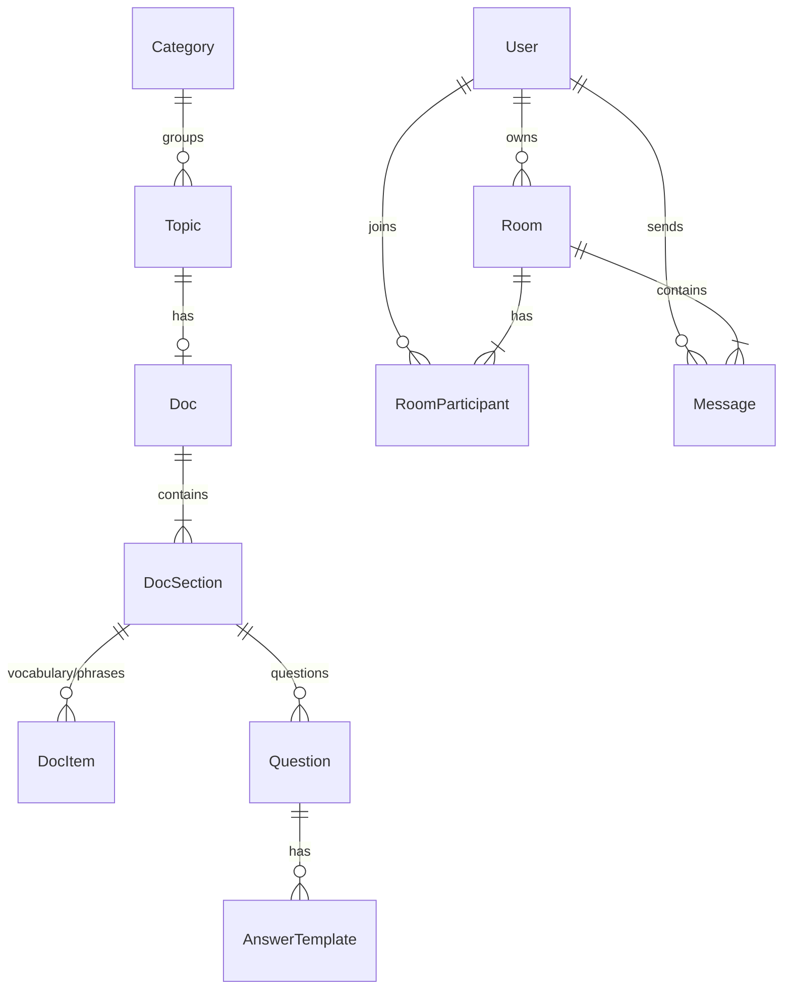

<!-- Purpose: Explains every database model, field, enum, and key config setting in the EnglishTalker system. -->

# 17 Models and Fields Reference

This document describes **what each model and field is for** in the EnglishTalker system. It reflects the **current implementation** in `backend/app/models/` (not the full future design in [07_Database.md](./07_Database.md)).

**Source of truth for code:** `backend/app/models/`  
**API wire types (frontend):** `frontend-web/src/lib/api/types.ts`  
**Request/response schemas:** `backend/app/schemas/`

---

## 1. Overview

EnglishTalker stores durable data in **PostgreSQL** (or SQLite for zero-setup dev). Volatile state (matching queues, live presence, rate limits) lives in **Redis** and is not modeled as database tables.

### 1.1 Entity groups

| Group | Models | Purpose |
|---|---|---|
| **Identity** | `User` | Learner profiles and optional login |
| **Learning content** | `Category`, `Topic`, `Doc`, `DocSection`, `DocItem`, `Question`, `AnswerTemplate` | Admin-managed topics and study material |
| **Conversation** | `Room`, `RoomParticipant`, `Message` | Live chat rooms and transcripts |
| **Personal notes** | `SentenceNote` | Saved useful sentences |

### 1.2 Relationship diagram

---

## 2. Shared building blocks

Every table uses these mixins from `backend/app/models/mixins.py`.

### 2.1 `UUIDPrimaryKeyMixin`

| Field | Type | Purpose |
|---|---|---|
| `id` | UUID | Primary key. Generated in the app (`uuid.uuid4`). Stable identifier across SQLite and Postgres. |

### 2.2 `TimestampMixin`

| Field | Type | Purpose |
|---|---|---|
| `created_at` | timestamptz | When the row was first inserted. |
| `updated_at` | timestamptz | When the row was last changed. Updated automatically on ORM save. |

---

## 3. Enumerations

Defined in `backend/app/models/enums.py`. Stored as short strings in the database; validated in the API layer.

| Enum | Values | Used for |
|---|---|---|
| `ConversationMode` | `normal`, `incognito` | Room privacy. Users only match and chat within the same mode. |
| `RoomKind` | `group`, `one_on_one` | Room shape. A 1-on-1 is a room with capacity 2. |
| `PlanTier` | `free`, `premium` | Subscription tier on user profiles. |
| `ContentStatus` | `draft`, `published`, `archived` | Admin content lifecycle. Only `published` is shown to learners. |
| `DocSectionType` | `vocabulary`, `phrases`, `questions`, `tips`, `text` | What a doc section holds and how the UI renders it. |

### Doc section type → content mapping

| Section type | Content location | Example |
|---|---|---|
| `vocabulary`, `phrases` | `doc_items` rows | Word lists, useful phrases |
| `questions` | `questions` + `answer_templates` | Warm-up practice prompts |
| `tips`, `text` | `doc_sections.body` | Free-form prose |

---

## 4. Database models

### 4.1 `User` — `users`

A lightweight learner profile. Login is **optional**: guests can use the app without an account; registered users get a username/password to restore their profile on another device.

| Field | Type | Nullable | Purpose |
|---|---|---|---|
| `id` | UUID | No | Primary key. |
| `display_name` | string(80) | No | Name shown in rooms and UI. |
| `username` | string(40) | Yes | Login handle. Unique when set. `NULL` for guests. |
| `password_hash` | string(255) | Yes | bcrypt hash of the password. Never store plain text. `NULL` for guests. |
| `is_admin` | boolean | No | Admin rights for managing topics and learning content. Set from `ADMIN_USERNAMES` on register/login — **not** a separate admin table. |
| `phone` | string(32) | Yes | Legacy field. No longer used for login. Kept for old rows. |
| `level` | string(40) | Yes | Self-reported English level (e.g. `beginner`, `intermediate`). |
| `interests` | string(300) | Yes | Comma-separated interests (e.g. `travel,music`). Used for matching hints. |
| `plan` | string(20) | No | Subscription plan: `free` or `premium`. Default `free`. |
| `created_at` | timestamptz | No | Row creation time. |
| `updated_at` | timestamptz | No | Last update time. |

**Admin note:** There is no pre-seeded admin user. Register or log in with a username in `ADMIN_USERNAMES` (default: `admin`) to get `is_admin = true`.

---

### 4.2 `Category` — `categories`

Groups topics into themes so a long topic list stays easy to browse (e.g. Daily Life, Work, Travel).

| Field | Type | Nullable | Purpose |
|---|---|---|---|
| `id` | UUID | No | Primary key. |
| `name` | string(120) | No | Display name shown in the UI. |
| `slug` | string(140) | No | URL-safe unique identifier. |
| `description` | text | Yes | Optional longer description. |
| `icon_url` | string(500) | Yes | Optional icon image URL. |
| `sort_order` | integer | No | Admin-controlled display order. Lower numbers appear first. |
| `created_at` | timestamptz | No | Row creation time. |
| `updated_at` | timestamptz | No | Last update time. |

---

### 4.3 `Topic` — `topics`

A conversation subject managed by admins. Topics appear in the topic picker and can link to study documentation.

| Field | Type | Nullable | Purpose |
|---|---|---|---|
| `id` | UUID | No | Primary key. |
| `category_id` | UUID (FK → `categories`) | Yes | Optional grouping. `NULL` → shown under "Other". Deleting a category sets this to `NULL`, not delete the topic. |
| `slug` | string(120) | No | URL-safe unique identifier. |
| `title` | string(200) | No | Display title. |
| `description` | text | Yes | Short summary for the topic card. |
| `level` | string(40) | Yes | Suggested difficulty (e.g. `beginner`, `advanced`). |
| `cover_image_url` | string(500) | Yes | Optional cover image. |
| `status` | string(20) | No | `draft`, `published`, or `archived`. Default `published`. |
| `sort_order` | integer | No | Display order within a category. |
| `created_at` | timestamptz | No | Row creation time. |
| `updated_at` | timestamptz | No | Last update time. |

---

### 4.4 `Doc` — `docs`

One topic has **at most one** doc. The doc is the root of the learning content tree (vocabulary, questions, tips, etc.).

| Field | Type | Nullable | Purpose |
|---|---|---|---|
| `id` | UUID | No | Primary key. |
| `topic_id` | UUID (FK → `topics`) | No | Parent topic. Unique — one doc per topic. Cascade delete with topic. |
| `title` | string(200) | Yes | Optional doc title. API falls back to the topic title if empty. |
| `intro` | text | Yes | Opening paragraph for the study page. |
| `level` | string(40) | Yes | Optional level override (same vocabulary as topics). |
| `status` | string(20) | No | `draft`, `published`, or `archived`. Default `draft`. Only published docs feed Warm-up Practice. |
| `created_at` | timestamptz | No | Row creation time. |
| `updated_at` | timestamptz | No | Last update time. |

**Relationship:** `sections` → ordered list of `DocSection` rows.

---

### 4.5 `DocSection` — `doc_sections`

One block inside a doc. The `type` field decides whether content lives in `items`, `questions`, or `body`.

| Field | Type | Nullable | Purpose |
|---|---|---|---|
| `id` | UUID | No | Primary key. |
| `doc_id` | UUID (FK → `docs`) | No | Parent doc. Cascade delete. |
| `type` | string(20) | No | One of `DocSectionType` values. Cannot be changed after creation (would orphan children). |
| `title` | string(200) | Yes | Section heading. |
| `body` | text | Yes | Free-form text for `tips` and `text` sections. Ignored for item/question sections. |
| `sort_order` | integer | No | Order within the doc. |
| `created_at` | timestamptz | No | Row creation time. |
| `updated_at` | timestamptz | No | Last update time. |

**Relationships:** `items` → `DocItem[]`, `questions` → `Question[]`

---

### 4.6 `DocItem` — `doc_items`

One vocabulary word or phrase inside a `vocabulary` or `phrases` section.

| Field | Type | Nullable | Purpose |
|---|---|---|---|
| `id` | UUID | No | Primary key. |
| `section_id` | UUID (FK → `doc_sections`) | No | Parent section. Cascade delete. |
| `term` | text | No | The word or phrase in English. |
| `phonetic` | string(200) | Yes | IPA pronunciation, e.g. `/ˈbrekfəst/`. |
| `meaning` | text | Yes | English definition or explanation. |
| `translation` | text | Yes | Translation into the learner's language. |
| `example` | text | Yes | Example sentence using the term. |
| `audio_url` | string(500) | Yes | Optional audio clip URL. |
| `sort_order` | integer | No | Order within the section. |
| `created_at` | timestamptz | No | Row creation time. |
| `updated_at` | timestamptz | No | Last update time. |

---

### 4.7 `Question` — `questions`

A conversation prompt inside a `questions` section. Powers **Warm-up Practice**.

| Field | Type | Nullable | Purpose |
|---|---|---|---|
| `id` | UUID | No | Primary key. |
| `section_id` | UUID (FK → `doc_sections`) | No | Parent section (must be type `questions`). Cascade delete. |
| `text` | text | No | The question in English. |
| `translation` | text | Yes | Translation of the question. |
| `audio_url` | string(500) | Yes | Optional audio clip URL. |
| `sort_order` | integer | No | Order within the section. |
| `created_at` | timestamptz | No | Row creation time. |
| `updated_at` | timestamptz | No | Last update time. |

**Relationship:** `answer_templates` → ordered list of `AnswerTemplate` rows.

---

### 4.8 `AnswerTemplate` — `answer_templates`

A fill-in-the-blank answer shape the learner can use when practicing a question.

| Field | Type | Nullable | Purpose |
|---|---|---|---|
| `id` | UUID | No | Primary key. |
| `question_id` | UUID (FK → `questions`) | No | Parent question. Cascade delete. |
| `template` | text | No | Answer shape, e.g. `"My favourite food is ___."` |
| `example` | text | Yes | Filled-in example, e.g. `"My favourite food is pizza."` |
| `translation` | text | Yes | Translation of the example. |
| `audio_url` | string(500) | Yes | Optional audio clip URL. |
| `sort_order` | integer | No | Order within the question. |
| `created_at` | timestamptz | No | Row creation time. |
| `updated_at` | timestamptz | No | Last update time. |

---

### 4.9 `Room` — `rooms`

A place users join to have a conversation (group or 1-on-1).

| Field | Type | Nullable | Purpose |
|---|---|---|---|
| `id` | UUID | No | Primary key. |
| `title` | string(200) | No | Room name shown in the lobby. |
| `owner_id` | UUID (FK → `users`) | Yes | Creator/host who can moderate. `NULL` for system-seeded demo rooms. |
| `mode` | string(20) | No | `normal` or `incognito`. Hard privacy partition. |
| `kind` | string(20) | No | `group` or `one_on_one`. Default `group`. |
| `topic` | string(120) | Yes | Free-text topic label for the room (not a FK to `topics`). |
| `level` | string(40) | Yes | Suggested level for this room. |
| `status` | string(20) | No | Room lifecycle. Currently `open` for joinable rooms. |
| `capacity` | integer | No | Max participants. Default 4. A 1-on-1 uses capacity 2. |
| `participant_count` | integer | No | Current active count (denormalized for fast lobby listing). |
| `password_hash` | string(255) | Yes | bcrypt hash of optional join password. `NULL` = public room. Never returned by the API. |
| `created_at` | timestamptz | No | Row creation time. |
| `updated_at` | timestamptz | No | Last update time. |

**Computed property:** `has_password` — `true` when `password_hash` is set (exposed in API, not the hash itself).

---

### 4.10 `RoomParticipant` — `room_participants`

Links a user to a room. Tracks who is currently inside.

| Field | Type | Nullable | Purpose |
|---|---|---|---|
| `id` | UUID | No | Primary key. |
| `room_id` | UUID (FK → `rooms`) | No | Room being joined. Cascade delete. |
| `user_id` | UUID (FK → `users`) | No | User in the room. Cascade delete. |
| `display_name` | string(80) | No | Name shown to others **in this room**. Snapshot at join time. In incognito mode this can differ from the profile name. |
| `left_at` | timestamptz | Yes | When the user left. `NULL` = still active in the room. |
| `created_at` | timestamptz | No | When the user joined. |
| `updated_at` | timestamptz | No | Last update time. |

---

### 4.11 `Message` — `messages`

One chat line in a room. Persisted so late joiners can load history and build a transcript.

| Field | Type | Nullable | Purpose |
|---|---|---|---|
| `id` | UUID | No | Primary key. |
| `room_id` | UUID (FK → `rooms`) | No | Room the message belongs to. Cascade delete. |
| `user_id` | UUID (FK → `users`) | No | Sender. Cascade delete. |
| `sender_name` | string(80) | No | Display name snapshot at send time. Keeps the transcript readable even if the profile changes later. |
| `text` | text | No | Message content. |
| `created_at` | timestamptz | No | Send time (also from `TimestampMixin`). |
| `updated_at` | timestamptz | No | Last update time. |

---

### 4.12 `SentenceNote` — `sentence_notes`

Useful sentences a user saves for later review (e.g. after AI improvement).

| Field | Type | Nullable | Purpose |
|---|---|---|---|
| `id` | UUID | No | Primary key. |
| `original_text` | text | Yes | What the user originally said or wrote. |
| `improved_text` | text | Yes | AI-corrected or improved version. |
| `source` | string(20) | No | Where the note came from: `self`, `ai`, etc. Default `self`. |
| `topic` | string(120) | Yes | Free-text topic tag for filtering notes. |
| `created_at` | timestamptz | No | Row creation time. |
| `updated_at` | timestamptz | No | Last update time. |

**Note:** `user_id` is planned but not yet in the model — notes are currently global/demo-scoped.

---

## 5. Configuration settings (not database tables)

These live in `backend/app/core/config.py` and are loaded from environment variables (`.env` or Docker env). They control behavior but are not stored as rows.

### Application

| Setting | Env var | Default | Purpose |
|---|---|---|---|
| `app_name` | `APP_NAME` | `EnglishTalker API` | Display name in OpenAPI docs. |
| `environment` | `ENVIRONMENT` | `development` | `development`, `staging`, or `production`. |
| `debug` | `DEBUG` | `true` | Verbose error output in dev. |
| `api_v1_prefix` | `API_V1_PREFIX` | `/api/v1` | Base path for all v1 routes. |

### Database and startup

| Setting | Env var | Default | Purpose |
|---|---|---|---|
| `database_url` | `DATABASE_URL` | SQLite file | Postgres URL in production. |
| `auto_create_tables` | `AUTO_CREATE_TABLES` | `true` | Dev only — create tables on startup. Use Alembic in production. |
| `seed_demo_data` | `SEED_DEMO_DATA` | `false` | Insert demo topics, rooms, users on startup. |
| `admin_usernames` | `ADMIN_USERNAMES` | `["admin"]` | Usernames that get `is_admin = true` on register/login. |

### Auth and security

| Setting | Env var | Default | Purpose |
|---|---|---|---|
| `secret_key` | `SECRET_KEY` | placeholder | Signs JWT session tokens. Must be strong in production. |
| `jwt_algorithm` | `JWT_ALGORITHM` | `HS256` | JWT signing algorithm. |
| `access_token_expire_minutes` | `ACCESS_TOKEN_EXPIRE_MINUTES` | `10080` (7 days) | How long a login session lasts. |
| `cors_origins` | `CORS_ORIGINS` | localhost URLs | Frontend origins allowed to call the API. |

### Infrastructure

| Setting | Env var | Default | Purpose |
|---|---|---|---|
| `redis_url` | `REDIS_URL` | `redis://localhost:6379/0` | Matching queues, pub/sub, rate limits. |

### AI and translation

| Setting | Env var | Default | Purpose |
|---|---|---|---|
| `anthropic_api_key` | `ANTHROPIC_API_KEY` | `null` | Claude API key for in-call AI coach. |
| `translation_model` | `TRANSLATION_MODEL` | `claude-haiku-4-5` | Model for Claude-based translation. |
| `assist_model` | `ASSIST_MODEL` | `claude-haiku-4-5` | Model for sentence improvement / reply ideas. |
| `translation_provider` | `TRANSLATION_PROVIDER` | `google` | Engine: `google`, `argos`, `claude`, `stub`, or `auto`. |
| `google_translate_api_key` | `GOOGLE_TRANSLATE_API_KEY` | `null` | Official Google Translate API key. |
| `argos_auto_download` | `ARGOS_AUTO_DOWNLOAD` | `true` | Download offline translation models on first use. |

### Speech-to-text

| Setting | Env var | Default | Purpose |
|---|---|---|---|
| `stt_provider` | `STT_PROVIDER` | `whisper` | Engine: `whisper`, `deepgram`, or `stub`. |
| `stt_model` | `STT_MODEL` | `base` | faster-whisper model size. |
| `deepgram_api_key` | `DEEPGRAM_API_KEY` | `null` | Deepgram API key. |
| `deepgram_model` | `DEEPGRAM_MODEL` | `nova-2` | Deepgram model name. |

---

## 6. API-only types (not persisted)

These appear in request/response bodies but have **no database table**.

| Type | Where | Purpose |
|---|---|---|
| `AuthResult` | `POST /auth/register`, `/auth/login` | Returns `user` + JWT `token`. |
| `TranslateRequest` / `TranslateResult` | `/translate` | In-room translation. |
| `AssistRequest` / `AssistResult` | `/assist` | AI sentence improvement or reply suggestions. |
| `MatchRequest` | `/match` | Criteria for 1-on-1 matchmaking (stored in Redis, not Postgres). |
| `TranscriptionResult` | `/transcribe` | Speech-to-text output. |
| `ModerateResult` | Room moderation endpoints | Mute/kick actions (state partly in Redis). |
| `Subscription` / `PlanLimits` | `/subscription` | Plan quotas (enforced in app logic). |

---

## 7. Redis keys (volatile, not SQL)

Matching, presence, and rate limiting use Redis. Data here is **rebuildable or discardable** — Postgres remains the system of record for durable entities above.

| Concern | Storage | Notes |
|---|---|---|
| Matchmaking queue | Redis | Waiting users paired by mode/topic/level. |
| Room presence | Redis / in-memory | Who is online right now in a WebSocket session. |
| Rate limits | Redis | API throttling counters. |

---

## 8. Quick reference — which model for which feature?

| Feature | Primary models |
|---|---|
| User registration / login | `User` |
| Admin topic management | `User.is_admin`, `Topic`, `Category` |
| Study page / Warm-up Practice | `Doc`, `DocSection`, `DocItem`, `Question`, `AnswerTemplate` |
| Room lobby | `Room` |
| Join / leave room | `Room`, `RoomParticipant` |
| Chat history | `Message` |
| Saved sentences | `SentenceNote` |
| 1-on-1 matching | Redis queue + `Room` (created when matched) |

---

## 9. Related documents

| Document | Content |
|---|---|
| [07_Database.md](./07_Database.md) | Full database design spec (includes future tables not yet implemented) |
| [08_API.md](./08_API.md) | HTTP endpoints that read/write these models |
| [06_Architecture.md](./06_Architecture.md) | System architecture and component boundaries |
| [backend/.env.example](../backend/.env.example) | Local environment variable template |
| [deploy/.env.prod.example](../deploy/.env.prod.example) | Production environment variable template |
